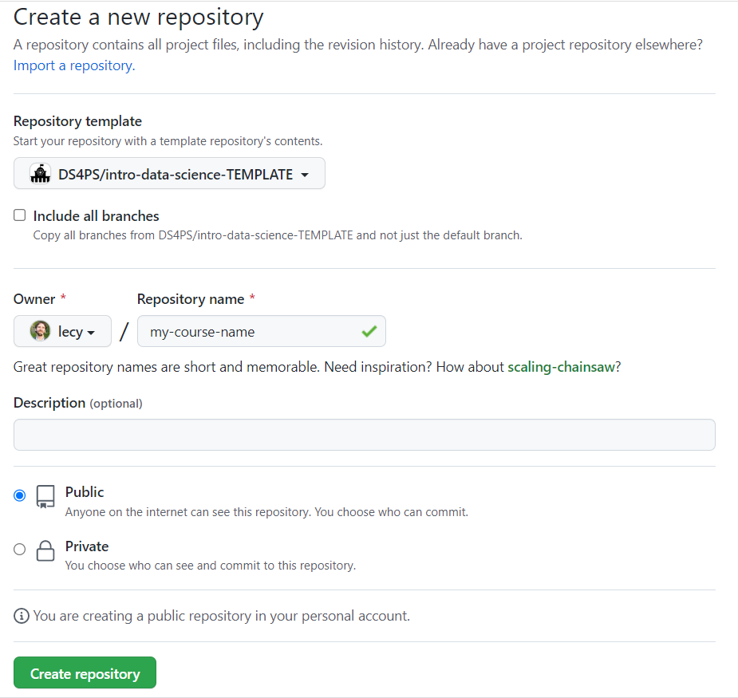
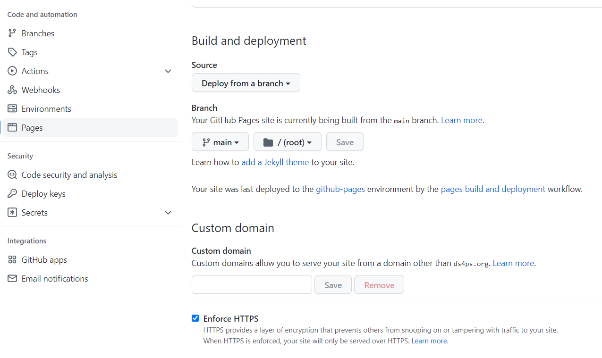
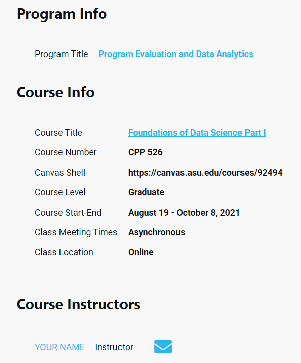
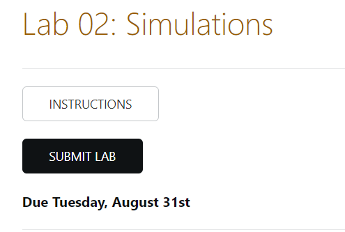

## GitHub Course Template 

This repository is designed as a demonstration for how instructors can use open source course files to share, adapt, repurpose and extended content. 

Multiple instructors have contributed lecture notes, labs, and videos to the repository. The content continues to evolve and improve over time. 

Anyone is free to fork the project and use material in their own classroom. 

If you have questions about using this class or configuring GitHub please open an issue on any topic you like: 

----

<!-- Place this tag where you want the button to render. -->
<a class="github-button" href="https://github.com/ds4ps/intro-data-science-TEMPLATE/issues" data-color-scheme="no-preference: dark; light: light; dark: dark;" data-icon="octicon-comment-discussion" aria-label="Discuss ds4ps/intro-data-science-TEMPLATE on GitHub">Discuss</a>

----

<br>


### GitHub as a Course Management System

GitHub has also developed powerful tools that make it easy to host your own course website for free. 

Even more impressive, you can clone this project, change a few settings to customize your class, and be up and running in 20 minutes. 

We have created a few basic page templates to make it easy to build a course site using basic [markdown](https://ds4ps.org/intro-data-science-TEMPLATE/markdown.html). 

* [Syllabus Page](https://ds4ps.org/intro-data-science-TEMPLATE/)
* [Semester Schedule](https://ds4ps.org/intro-data-science-TEMPLATE/schedule/)
* [Lecture Notes](https://ds4ps.org/intro-data-science-TEMPLATE/units/01-building-blocks-of-r/topic-01x02-functions.html)
* [Lab Instructions](https://ds4ps.org/intro-data-science-TEMPLATE/units/02-operators-and-descriptives/lab-02-instructions.html)
* [Review Sessions](https://watts-college.github.io/cpp-527-fall-2021/review/)


### Setup Overview

In order to create your own course website you need to complete the following steps: 

1. Clone this repository using it as a template, or alternatively fork it. 
2. Under settings activate the GitHub pages option. 
3. Customize the course parameters in the header of each page, such as course info, instructor info, and assignment due dates. 

That's it! You are ready to go. Once pages are activated on GitHub the rest of the files should have rendered to HTML as the GitHub servers and will be live after just a few minutes. 

You can now customize the course shell by editing any of the markdown files in the root folder, such as the syllabus (index.md) or schedule (schedule.md). 

If you want to change any of the course material you need to make a copy of the files on your local machine by **cloning** the repo. You can then edit R Markdown files in the **units**, knit them to create new HTML files, then sync those files to GitHub. I would recommend using the [GitHub desktop tool](https://desktop.github.com/), which makes these steps easy. 

**Cloning  in GitHub Desktop**

> File >> Clone repository 

Use the URL of your GitHub repository (for example, https://github.com/DS4PS/intro-data-science-TEMPLATE) and save the project folder in your preferred local directory. 

**Syncing Files**

After local files have been updated you send them back to GitHub using the commit >> push commands. 


<br> 
<hr> 
<br>


## Using GitHub Templates 

This tutorial will walk you through the steps of creating your own course using these files as a template. 

You will start by navigating to your personal GitHub account and select the option to create a new repository. When you do so you will get the following dialogue: 

<br>


    

    

Select: 

* DS4PS/intro-data-science-TEMPLATE 
* public repository 
* There is only one branch, so no need to include all branches. 

If you are unable to access the template you can always fork or clone the project repository as well. The main advantage of using a template is that it copies all of the files to for you quickly, but you can accomplish the same thing by cloning the repository instead. 

<br> 
<hr> 
<br>


### Activating GitHub Pages

You can always view files in a public GitHub repository, but if you want to host HTML files as a live site you first need to activate GitHub pages. 

After you have cloned the course repo onto your personal account navigate to your new project page on GitHub and select:

Settings >> Pages  >> Main Branch >> Root Folder

<br> 



 
<br> 

Once pages are activated then all markdown files will be rendered to HTML on the GitHub servers and all HTML files in your repository will now be visible as website pages instead of raw HTML code. 

<br> 
<hr> 
<br>


### Setting Global Parameters in _config.yml

The **configuration file** (_config.yml) contains a few settings for the full website. 


```
###
###  COURSE INFO
###

github_info:
    username:       DS4PS   # GitHub account name
    branch:         master
    website-repo:   intro-data-science-TEMPLATE
    course-repo:    intro-data-science-TEMPLATE
 
description:        Intro. course in data science

url:                "https://ds4ps.github.io"
baseurl:            "/intro-data-science-TEMPLATE"
course_url:         "https://ds4ps.github.io/intro-data-science-TEMPLATE/"
title:              ds4ps   # GitHub account name

brand:
    text:           "Intro to Data Science"   
```

There are options to customize the site with some branding from your home university or program. 

The **program-website** parameter sets the link attached to the sun at the top-right of the course navigation bar. You can link this back to your home program or another site. 

The **demo-logo.png** is a DIY logo that can be made by saving some power point text as a PNG image. See the file [program-logo.pptx](https://github.com/DS4PS/intro-data-science-TEMPLATE/blob/main/program-logo.pptx) for an example. 

Save your logo into the folder **assets/img/logo-name.png** and updated the YAML field accordingly. Currently it is set to **demo-logo.png**. 

```
###
###  YOUR PROGRAM INFO
###

program-logo:       "demo-logo.png"
program-website:    "https://ds4ps.org/ms-prog-eval-data-analytics/courses/"
```  

You will provide some instructor information on the syllabus page. That information can be referenced anywhere on the syllabus. 

Fields in the _config.yml file are unique in that they are global variables, so they can be referenced anywhere in the site as `{{site.varname}}`. Add any YAML fields here that you would like to reference on several pages, like the link to schedule office hours. 


```      
###
### COURSE INSTRUCTOR:
###

author:
    name:       Professor Who
    github:     doctorprofessorwho   # Github username for avatar

calendly:      'https://calendly.com/fakename'
```

And finally, the pages visible on the navigation bar are set here. The "title" value is the text that will appear on the navigation bar, and the "url" can be the name of the markdown file that contains the page information, or it can be a full URL including external links. 

```
###
### NAVIGATION BAR
###

header:
- title: Syllabus
  url:
- title: Course Schedule
  url: schedule/
- title: Review Sessions
  url: review/
- title: Resources
  url: resources/
- title: Get Help
  url: help/

```


## Customizing Course Pages 

* index.md (syllabus / course landing page) 
* schedule.md  
* review.md  
* help.md 


### Syllabus Parameters

```
---
layout: index
title: Syllabus

index:
    title: Foundations of Data Science Part I
    image: data-science.png
    subtitle: This course introduces students to the field of data science and its applications in the public and nonprofit sectors. Modern performance management and evaluation processes require strong data literacy and the ability to combine and analyze data from a variety of sources to inform managerial processes. We offer a practical, tools-based approach that is designed to build strong foundations for people that want to work as analysts, data-driven managers, or data-driven journalists. We will cover data programming fundamentals, visualization, text analysis, automated reporting, and dynamic reporting using dashboards. The course is analytically rigorous, but no prior programming experience is assumed.

info:
 program_title: Program Evaluation and Data Analytics
 program_website: https://asuonline.asu.edu/online-degree-programs/graduate/program-evaluation-and-data-analytics-ms/
 course_title: Foundations of Data Science Part I
 course_number: CPP 526
 course_level: Graduate
 course_website: 'https://canvas.asu.edu/courses/92494'
 course_start_end_dates: August 19 - October 8, 2021
 course_prerequisites:  
 class_meets_when:  Asynchronous  
 class_meets_where:  Online
 discussion_board_url: 'https://watts-college.github.io/cpp-526-fall-2021/help/'

instructor:
-  name: YOUR NAME
   title: Instructor
   email: EMAIL@asu.edu
   office_location:
   website_url:
   github_url:  
   twitter_url:
   scholar_url:
   linked_in_url:
   office_hours_time: See Schedule
   office_hours_app_url: 'https://calendly.com/jacobtnyoung/cpp-526-student-meeting'
   office_hours_location: Zoom


textbooks:
- title: R Cookbook, 2nd Edition
  authors: P. Teetor & Teetor, J.
  edition: 2019
  link: https://rc2e.com/
  required: Not Required
- title: R for Data Science
  authors: Wickham, H., & Grolemund, G.
  edition: Free Online
  link: http://r4ds.had.co.nz/
  required: Not Required

...

---
```

<br> 

Once rendered on the syllabus page, the fields will look like this: 

<br> 





### Schedule Parameters

```
---
layout: default
title: Schedule

canvas: 
  assignment_url: 'https://canvas.asu.edu/courses/99223/assignments'
  
yellowdig_url: 'https://canvas.asu.edu/courses/99223/assignments/2552420'

yellowdig: 
  post-01: 'Friday, August 20th'
  post-02: 'Friday, August 27th' 
  post-03: 'Friday, September 3rd' 
  post-04: 'Friday, September 10th' 
  post-05: 'Friday, September 17th' 
  post-06: 'Friday, September 24th' 
  post-07: 'Friday, October 4th' 

labs:
  lab-01:  'Thursday, Aug 26th' 
  lab-02:  'Tuesday, August 31st'
  lab-03:  'Thursday, September 9th'
  lab-04:  'Tuesday, September 14th'
  lab-05:  'Tuesday, September 21st'
  lab-06:  'Monday, October 1st'
  
---
```


You can reference YAML variables on the page by placing a YAML reference within double-squiggly brackets. 

YAML variables follow the format: **page.variable-group.variable-name**

For example, the Canvas platform might be used to submit assignments. If the URL is stored as a YAML variable it can be referenced throughout the schedule when assignments are due. Next semester we only have to update the URL once in the YAML header and every other reference on the schedule will use the current URL. 

Written as a YAML field: 

```
canvas: 
  assignment_url: 'https://canvas.asu.edu/courses/99223/assignments'
```

To insert the URL anywhere in the document use: 

```
{{ page.canvas.assignment_url }}
```

For example, the lab due date and submission options are written as follows: 

```
## Lab 02: Simulations  
  
<a class="uk-button uk-button-default" href="../labs/lab-02-instructions.html">INSTRUCTIONS</a>

<a class="uk-button uk-button-primary" href="{{page.canvas.assignment_url}}">SUBMIT LAB</a>

**Due {{page.labs.lab-02}}**
```

And will show up like this on the page: 



 

<br> 
<hr>
<br>


### Review Session Parameters 


<br>
<hr>
<br>


## Discussion Boards 

https://ds4ps.org/intro-data-science-TEMPLATE/help/


<!-- Place this tag in your head or just before your close body tag. -->
<script async defer src="https://buttons.github.io/buttons.js"></script>
